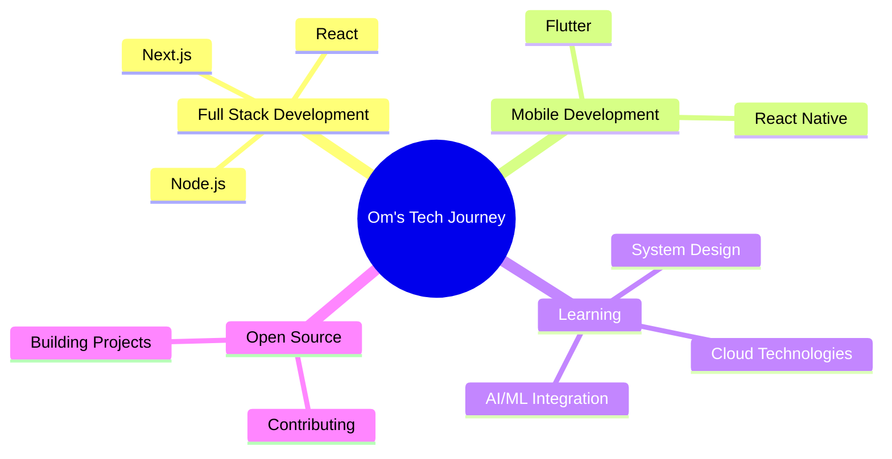

<div align="center">
  


<br/>

<!-- Social Badges with Hover Effects -->
<p align="center">
  <a href="https://www.linkedin.com/in/omprakash-nitdgp/">
    
  </a>
  <a href="https://twitter.com/intent/follow?screen_name=om_prakash_nit">
    
  </a>
  <a href="mailto:omprakashnitdgp@gmail.com">
    
  </a>
  <a href="https://github.com/om-prakash-yadav">
    
  </a>
</p>

<!-- Profile Stats Badges -->
<p align="center">
  
  
  
</p>

</div>

<br/>

## � About Me

<table>
<tr>
<td width="50%">

```typescript
const om = {
    education: "NIT Durgapur 🎓",
    location: "India 🇮🇳",
    role: "Software Engineer",
    code: ["C++", "TypeScript", "JavaScript", 
           "Python", "Dart"],
    technologies: {
        frontend: ["React", "Next.js", "TailwindCSS"],
        mobile: ["React Native", "Flutter"],
        backend: ["Node.js", "Django"],
        databases: ["MongoDB", "Firebase"],
        tools: ["Git", "Linux", "Figma"]
    },
    currentFocus: "Building scalable applications",
    funFact: "I learn, sleep, repeat! 😴💭"
};
```

</td>
<td width="50%">


### � What I Do

```diff
+ 🔭 Building scalable web & mobile applications
+ 💻 Crafting seamless user experiences
+ 🌱 Constantly learning new technologies
+ 💬 Available to help & collaborate
+ ⚡ Quick responder - ping me anytime!
```

</td>
</tr>
</table>

<div align="center">
  
</div>

<br/>

## 🛠️ Tech Stack & Tools

<div align="center">

### 💻 Languages


### 🎨 Frontend Development


### 📱 Mobile Development


### ⚙️ Backend & Database


### 🔧 Tools & Technologies


</div>

<div align="center">
  
</div>

<br/>

## 📊 GitHub Analytics

<div align="center">
  
  
</div>

<div align="center">
  
  
</div>

<!-- Activity Graph -->
<div align="center">
  
</div>

<br/>

## 🏆 GitHub Achievements

<div align="center">
  
</div>

<br/>

## � Quote of the Day

<div align="center">
  


</div>

<br/>

## 🎯 Current Focus

<div align="center">



</div>

<br/>

## � Contribution Metrics

<div align="center">
  


</div>

<br/>

---

<div align="center">

## 💬 Let's Connect & Collaborate!


### 📫 Reach Out To Me

**💼 Open for collaborations on exciting projects!**  
**🌟 Let's build something amazing together!**

<br/>

</div>

<div align="center">
  
</div>

<!-- Animated Footer -->
<div align="center">
  
</div>
