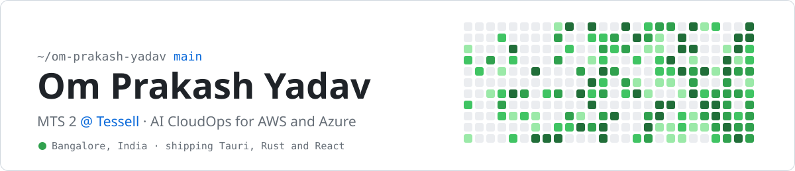
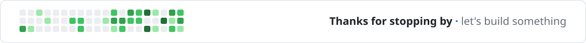

  <picture>
    <source media="(prefers-color-scheme: dark)" srcset="./assets/header-dark.svg" />
    
  </picture>

  <a href="https://om-portfolio-delta.vercel.app"><picture><source media="(prefers-color-scheme: dark)" srcset="https://img.shields.io/badge/Portfolio-21262d?style=flat-square&logo=vercel&logoColor=e6edf3" /></picture></a>
  <a href="https://www.linkedin.com/in/omprakash-nitdgp/"><picture><source media="(prefers-color-scheme: dark)" srcset="https://img.shields.io/badge/LinkedIn-21262d?style=flat-square&logo=linkedin&logoColor=e6edf3" /></picture></a>
  <a href="https://twitter.com/intent/follow?screen_name=om_prakash_nit"><picture><source media="(prefers-color-scheme: dark)" srcset="https://img.shields.io/badge/X-21262d?style=flat-square&logo=x&logoColor=e6edf3" /></picture></a>
  <a href="mailto:omprakashnitdgp@gmail.com"><picture><source media="(prefers-color-scheme: dark)" srcset="https://img.shields.io/badge/Email-21262d?style=flat-square&logo=gmail&logoColor=e6edf3" /></picture></a>
  

 

<picture>
  <source media="(prefers-color-scheme: dark)" srcset="https://user-images.githubusercontent.com/74038190/229223263-cf2e4b07-2615-4f87-9c38-e37600f8381a.gif" />
  
</picture>

## Hey there 

I'm **Om**, a **Full-Stack Software Engineer** and **Member of Technical Staff 2** at **[Tessell](https://www.tessell.com)** in Bangalore.

I build Tessell's **AI-powered CloudOps desktop app** for AWS and Azure, with **Tauri, Rust, React and TypeScript**. I also build **AI agents** with LLMs, RAG and MCP. Before Tessell I built full-stack healthcare software at **Deloitte USI**, and I still sneak Flutter packages onto pub.dev on weekends.

- 🔭 &nbsp;Building a desktop app that talks to your whole cloud estate
- 🏆 &nbsp;**#1 for Most Ships to Production** (3rd overall) in Tessell's company-wide hackathon
- 🦀 &nbsp;Getting properly good at Rust
- 📦 &nbsp;Author of **[liquid_glass_nav](https://pub.dev/packages/liquid_glass_nav)** on pub.dev
- 🎓 &nbsp;B.Tech, **NIT Durgapur**
- ⚡ &nbsp;Fun fact: I debug with `console.log` and I'm not ashamed

 

---

## 💼 Where I've worked

<table>
  <tr>
    <td width="72" align="center" valign="top"></td>
    <td valign="top">
      <b>Member of Technical Staff 2</b> · <a href="https://www.tessell.com">Tessell</a> &nbsp;Mar 2026 – now · Bangalore 
      Tessell's AI CloudOps desktop app: onboarding with AWS/Azure profile discovery and a bundled Python runtime, the Cloud Estate browser and its interactive network topology, OAuth integrations for GitHub, Google Drive, Jira, Linear and Slack (tokens kept in the OS keychain), and step-by-step runbook execution for cloud findings. Also designed AI agents for SRE and DBA workflows that automate incident linkage, deployment tracking and reliability reports.
    </td>
  </tr>
  <tr>
    <td width="72" align="center" valign="top"></td>
    <td valign="top">
      <b>Software Engineer</b> · Deloitte USI &nbsp;Jul 2024 – Feb 2026 · Hyderabad 
      Full-stack modules for Henry Schein's healthcare suite, serving 1M+ customers across 300+ clinical solutions: Node.js/Express.js REST APIs with HIPAA-ready JWT auth, and reusable React.js components that cut load times by 25%. Core Web Vitals up 20%. 🏆 Applause and Spot Awards.
    </td>
  </tr>
  <tr>
    <td width="72" align="center" valign="top"></td>
    <td valign="top">
      <b>Software Developer Intern</b> · TetraTrion Technologies &nbsp;Aug 2023 – Jul 2024 · Bhubaneswar 
      Client-facing dashboards for Digi Ubique's industrial clients, with Node.js REST APIs behind React and ECharts UIs.
    </td>
  </tr>
</table>

## 🚀 Things I've built

<table>
  <tr>
    <td width="50%" valign="top">
       
      <b>AI CloudOps Desktop App</b> @ Tessell 
      AI-powered CloudOps desktop app for AWS and Azure. 
      <picture><source media="(prefers-color-scheme: dark)" srcset="https://img.shields.io/badge/Tauri-21262d?style=flat-square&logo=tauri&logoColor=e6edf3" /></picture> <picture><source media="(prefers-color-scheme: dark)" srcset="https://img.shields.io/badge/Rust-21262d?style=flat-square&logo=rust&logoColor=e6edf3" /></picture> <picture><source media="(prefers-color-scheme: dark)" srcset="https://img.shields.io/badge/React-21262d?style=flat-square&logo=react&logoColor=e6edf3" /></picture>
    </td>
    <td width="50%" valign="top">
       
      <b><a href="https://github.com/om-prakash-yadav/liquid-glass-navigation">Liquid Glass Nav</a></b> · <a href="https://pub.dev/packages/liquid_glass_nav">pub.dev</a> 
      Glassmorphism bottom navigation bar for Flutter. 
      <picture><source media="(prefers-color-scheme: dark)" srcset="https://img.shields.io/badge/Flutter-21262d?style=flat-square&logo=flutter&logoColor=e6edf3" /></picture> <picture><source media="(prefers-color-scheme: dark)" srcset="https://img.shields.io/badge/Dart-21262d?style=flat-square&logo=dart&logoColor=e6edf3" /></picture>
    </td>
  </tr>
  <tr>
    <td width="50%" valign="top">
       
      <b><a href="https://github.com/om-prakash-yadav/passion-browser">Passion Browser</a></b> 
      Web browser with built-in ad blocking and a Material 3 UI. 
      <picture><source media="(prefers-color-scheme: dark)" srcset="https://img.shields.io/badge/Flutter-21262d?style=flat-square&logo=flutter&logoColor=e6edf3" /></picture> <picture><source media="(prefers-color-scheme: dark)" srcset="https://img.shields.io/badge/Material_3-21262d?style=flat-square&logo=materialdesign&logoColor=e6edf3" /></picture>
    </td>
    <td width="50%" valign="top">
       
      <b><a href="https://om-portfolio-delta.vercel.app">This portfolio</a></b> · <a href="https://github.com/om-prakash-yadav/om-portfolio">code</a> 
      A scroll-driven three.js scene and a 3D coverflow of my work. 
      <picture><source media="(prefers-color-scheme: dark)" srcset="https://img.shields.io/badge/Next.js-21262d?style=flat-square&logo=nextdotjs&logoColor=e6edf3" /></picture> <picture><source media="(prefers-color-scheme: dark)" srcset="https://img.shields.io/badge/three.js-21262d?style=flat-square&logo=threedotjs&logoColor=e6edf3" /></picture> <picture><source media="(prefers-color-scheme: dark)" srcset="https://img.shields.io/badge/GSAP-21262d?style=flat-square&logo=greensock&logoColor=e6edf3" /></picture>
    </td>
  </tr>
</table>

More: <a href="https://github.com/om-prakash-yadav/Hospital-Management-System-User-Side">Hospital Management System</a> (MERN, <a href="https://hospital-management-system-user-sid.vercel.app/">live</a>) · <a href="https://www.homekich.com/">Homekich</a> and <a href="https://wikolo.com/">Wikolo</a> (Flutter apps)

## 🧰 Toolbox

  <picture>
    <source media="(prefers-color-scheme: dark)" srcset="https://skillicons.dev/icons?i=ts,js,java,rust,python,dart,react,nextjs,angular,tauri,flutter,threejs,tailwind,redux,nodejs,express,spring,graphql,postgres,mongodb,dynamodb,redis,aws,azure,docker,kubernetes,terraform,kafka,git,figma&perline=15&theme=dark" />
    
  </picture>

## 📊 Numbers

  <picture>
    <source media="(prefers-color-scheme: dark)" srcset="https://github-stats-extended.vercel.app/api?username=om-prakash-yadav&show_icons=true&hide_rank=true&count_private=true&bg_color=0d1117&title_color=58a6ff&icon_color=3fb950&text_color=c9d1d9&border_color=30363d" />
    
  </picture>
  <picture>
    <source media="(prefers-color-scheme: dark)" srcset="https://github-stats-extended.vercel.app/api/top-langs?username=om-prakash-yadav&layout=compact&langs_count=8&hide=html,jupyter%20notebook&bg_color=0d1117&title_color=58a6ff&text_color=c9d1d9&border_color=30363d" />
    
  </picture>
   
  <picture>
    <source media="(prefers-color-scheme: dark)" srcset="https://streak-stats.demolab.com?user=om-prakash-yadav&hide_border=false&border=30363d&background=0d1117&ring=3fb950&fire=3fb950&currStreakLabel=3fb950&sideLabels=58a6ff&currStreakNum=e6edf3&sideNums=e6edf3&dates=8b949e&stroke=30363d" />
    
  </picture>

  <picture>
    <source media="(prefers-color-scheme: dark)" srcset="https://raw.githubusercontent.com/om-prakash-yadav/om-prakash-yadav/output/github-contribution-grid-snake-dark.svg" />
    
  </picture>

## 😂 Dev life, honestly

<table>
  <tr>
    <td align="center" width="50%"> <b>Friday, 5:59 pm, prod is on fire</b></td>
    <td align="center" width="50%"> <b>Me fixing one bug and finding three more</b></td>
  </tr>
  <tr>
    <td align="center" width="50%"> <b>How I think I look when the build passes</b></td>
    <td align="center" width="50%"> <b>How I actually look</b></td>
  </tr>
</table>

  <picture><source media="(prefers-color-scheme: dark)" srcset="https://readme-jokes.vercel.app/api?bgColor=%230d1117&textColor=%23e6edf3&aColor=%2358a6ff&borderColor=%2330363d" /></picture>

---

  <b>Let's build something together.</b> Say hi on <a href="https://www.linkedin.com/in/omprakash-nitdgp/">LinkedIn</a> or <a href="mailto:omprakashnitdgp@gmail.com">email</a> 👋

<picture>
  <source media="(prefers-color-scheme: dark)" srcset="./assets/footer-dark.svg" />
  
</picture>
